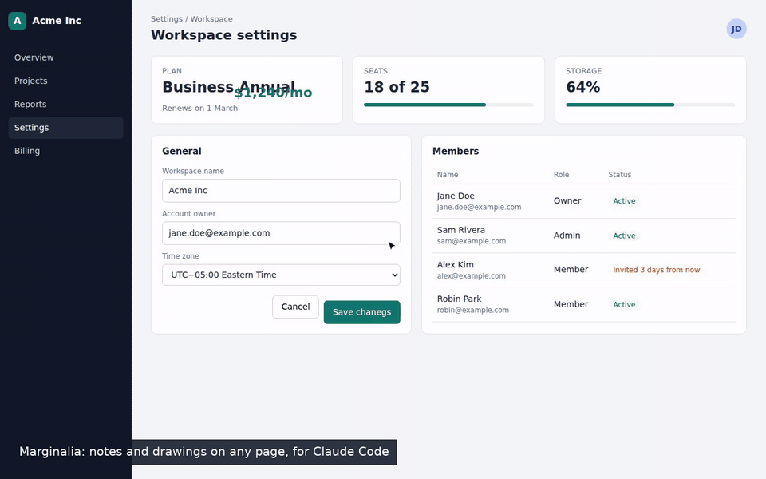

# Marginalia

Pin notes and drawings on any web page, then hand them to Claude Code as annotated
screenshots so it can fix what you marked.

Marginalia is a Chrome extension for UI review: QA passes, design feedback, bug bashes.
You click an element, write a note, and Marginalia captures the screen with the element
outlined and numbered. Send the notes live to a Claude Code session while you work, export
them as a folder an agent can read, or export one offline HTML report.



The full-quality version is [docs/demo.mp4](docs/demo.mp4).

Plain JavaScript, Manifest V3, no build step and no dependencies.

## Features

- **Notes on elements or regions.** Hover to outline an element, click to attach a note, or
  drag to mark an area. Notes get numbered pins that follow the element through scrolls,
  resizes and single-page-app re-renders.
- **Drawing.** Pen, highlighter, arrow, rectangle, ellipse, text label and redact, with undo
  and redo.
- **Redaction burned into pixels.** Redacted areas are painted solid into the stored
  screenshot, so the raw pixels never reach an export.
- **Live to Claude.** Each saved note goes to one Claude Code session with its screenshot.
  Claude replies with the cause and a fix, and marks the pin resolved when it is done.
- **Export for agent.** A folder with `notes.md` and one annotated PNG per snapshot.
- **HTML report.** One self-contained offline file per session.
- **Sessions and history.** Browse, rename, resume, re-export or delete past sessions.

## Repository layout

| Path | What it is |
|---|---|
| `extension/` | The Chrome extension. Load this folder unpacked. |
| `claude-mod/` | The Claude Code mod that receives live notes and adds `/marginalia`. |
| `dev/` | Development helpers: icon generator, and `record-demo.mjs`, which records `docs/demo.*` against the sample page in `dev/demo/`. |
| `sync-to-windows.sh` | Copies `extension/` to Windows when the repo lives in WSL. |
| `CLAUDE-SETUP.md` | Install steps written for Claude Code to follow. |

## Install

### Let Claude Code do it

Clone the repo and tell Claude Code:

```
Follow CLAUDE-SETUP.md in this repo and install Marginalia for me.
```

It configures the mod and prepares the extension folder. You click **Load unpacked** in
Chrome yourself; Claude cannot do that step.

### By hand

**Extension**

1. Open `chrome://extensions` and switch on **Developer mode**.
2. Click **Load unpacked** and select the `extension/` folder.
3. Pin Marginalia to the toolbar.

On Windows with the repo in WSL, run `./sync-to-windows.sh` and load
`C:\Users\<you>\Downloads\marginalia` instead. Run the script again after every change,
then click reload on the extension card.

Pages that were open before the extension loaded need a reload before you can annotate them.

**Claude Code mod** (only for Live to Claude)

The mod needs Node 20 or later on `PATH`.

1. Add the absolute path of `claude-mod/` to `CLAUDE_CODE_PLUGIN_DIRS` under `env` in
   `~/.claude/settings.json`. Separate several entries with `:`.
   ```json
   "env": { "CLAUDE_CODE_PLUGIN_DIRS": "/home/<you>/marginalia/claude-mod" }
   ```
2. Restart Claude Code. `/marginalia` is now a command.

## Use

1. Open the popup and start a session. The name defaults to today's date.
2. **Annotate** (`Alt+Shift+N`): hover to outline an element, click to attach a note, or
   drag to mark a region. Click a numbered pin to edit, resolve or delete its note.
3. **Draw** (`Alt+Shift+D`): pick a tool and draw. `Ctrl+Z` / `Ctrl+Shift+Z` undo and redo.
   `Esc` saves and exits; Cancel discards.
4. The floating bar at the bottom right lists the notes on the current page (click one to
   scroll to it), hides or shows the pins, and switches modes. `Esc` leaves any mode.
5. **End session** in the popup downloads `marginalia-<session-name>.html`.

Open **history** from the popup to browse, rename, delete, resume or re-export sessions,
and to delete sessions older than N days. Resuming a session shows its pins again on live
pages.

Change the shortcuts at `chrome://extensions/shortcuts`.

### Live to Claude

1. In the Claude Code session that should get the notes, run `/marginalia`. That session
   starts a receiver on `127.0.0.1:47321`. Only one session receives notes. Running
   `/marginalia` in another session moves the receiver there; `/marginalia stop` ends it.
2. In the popup, switch on **Live to Claude**. The popup says whether a session is listening.
3. Each saved note (new or edited) and each drawing is sent with its annotated screenshot.
   By default Claude starts on its own 8 seconds after your last note and replies with the
   cause and a proposed fix for each. `/marginalia quiet` makes notes wait for your next
   prompt instead; `/marginalia auto` switches back.
4. A note saved while no session listens waits in the extension and is sent when one does.
5. When Claude fixes a note, it marks it resolved. The pin turns resolved within about 30
   seconds, and its tooltip shows Claude's one-line comment.

### Export for agent

**Export for agent** (in the popup, or next to Export in history) downloads a folder
`marginalia-<session-name>/` with `notes.md` and one PNG per snapshot (`01-<page>.png`, ...).
The PNGs have the borders, numbered badges and drawings painted in. The numbers match the
notes in `notes.md`, which also lists each note's selector, text fingerprint, DOM path and
box. The export does not end the session. To hand it to Claude Code:

```
Read ~/Downloads/marginalia-2026-10-05/notes.md and the PNGs it links, then fix the notes.
```

From WSL the folder is under `/mnt/c/Users/<you>/Downloads/`.

## How it works

- Every saved note or finished drawing captures the visible tab. Marginalia hides its own
  UI for the capture. Notes and drawings on the same URL (including `#/` hash routes),
  scroll position, viewport and pixel ratio share one snapshot; a new capture replaces
  its image. The capture is refused with a message when the tab is not in front, the
  page moved since the save, or pinch zoom is active.
- Element borders and drawings are stored as data and drawn over the screenshot in the
  report. Redactions are the exception: the service worker paints them as solid boxes
  into the stored image. A snapshot with a redaction is never captured again; a later save
  in the same state starts a new snapshot, which needs its own redaction.
- Exports are built as Blobs in an offscreen document and downloaded from a `blob:` URL.
- Pins re-find their element by CSS selector, then by text fingerprint, then by DOM path.
  A note whose element is gone is marked orphaned in the list; it is never dropped.
- The content script runs on every page but does nothing until a session is active.
- The Claude Code mod runs a small HTTP server on `127.0.0.1:47321`. It accepts requests
  only from a `chrome-extension://` origin and writes screenshots to
  `~/.claude/marginalia-inbox/`.

## Privacy

All data stays in this browser, in the extension's IndexedDB. With Live to Claude on, notes
and screenshots go to the mod on `127.0.0.1` and from there into your Claude Code session.
Nothing else leaves the machine.

Caution: screenshots show whatever was on screen. A report that contains snapshots from a
host other than `localhost` or `127.0.0.1` is flagged as non-local and can contain real
user data. Use the redact tool before you capture anything sensitive, and check exports
before you share them.

## Known limitations

- Pages that handle keys or clicks in their own capture phase can still see some input
  while annotate mode is on.
- Clicks inside iframes are not intercepted, and iframes are not annotated.
- Two notes saved at the same moment from different tabs can get the same number.

## Files

| File | Purpose |
|---|---|
| `extension/manifest.json` | MV3 manifest, permissions and shortcuts |
| `extension/background.js` | Sessions, capture queue, redaction burn-in, export download, live send |
| `extension/db.js` | IndexedDB access for the service worker and offscreen document |
| `extension/content.js` | In-page pins, annotate and draw modes, floating list |
| `extension/renderer.js`, `report.css` | Report renderer shared by the history page and the export |
| `extension/popup.html`, `popup.js` | Toolbar popup |
| `extension/history.html`, `history.js` | Session history and viewer |
| `extension/offscreen.html`, `offscreen.js` | Builds the HTML export and the agent export as Blobs |
| `extension/ui.css` | Styles for the popup and history page |
| `extension/icons/` | Toolbar icons; regenerate with `node dev/make-icons.mjs` |
| `claude-mod/hooks/register.ts` | Mod entry: `/marginalia` command, inbox tool, bridge lifecycle |
| `claude-mod/bridge/server.mjs` | Local HTTP receiver for live notes |
